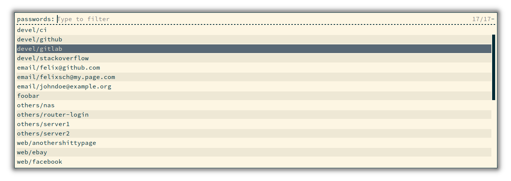

# rofi-password
A simple helper script to interact with passwords managed by [pass](https://www.passwordstore.org/) through [rofi](https://github.com/davatorium/rofi) and additionally generate 2fa tokens.


### Usage

```
  rofi-password - Simple rofi pass integration script

  Usage: rofi-password [FLAGS] [SELECTED]
  Optional flags are:
    -h | --help                      Shows this help information
    -g | --generate-token SELECTED   Generates a TOTP (2FA) token
```

### Installation

This script **requires** the following tools to be installed in your desktop environment:

  * `pass` the password manager
  * `rofi` the deskto menu
  * `xclip, xset` to copy values to clipboard
  * `xdotool` to type the values for you
  * `oathtool` to generate 2fa tokens from a totp secret
  
Other than that, just copy the script to your prefered location (e.g. `/usr/local/bin` or `$HOME/bin/`).
  
### Configuration
`rofi-password` sources a bash file from `$HOME/.config/rofi-password.conf`.

Example configuration:

```
# path to the password store (default: $HOME/.password-store)
# PASSWORD_STORE = ""

# marker to detect if a password entry has a totp token set (default: totp)
# MARKER_TWOFA = ""

# rofi theme to be used (default: none)
# ROFI_THEME = ""

# rofi extra arguments to supply (default: none)
# ROFI_EXTRA_ARGS = ""

# how to display the password (first line in a password entry) (default: Password)
# LABEL_PASSWORD = ""

# how to display 2FA (TOTP) token generation (default: 2FA token)
# LABEL_TWOFA = ""

# clear clipboard after in seconds (default: 30)
# CLEAR_CLIPBOARD_AFTER = ""

# xclip extra arguments (default: none)
# XCLIP_EXTRA_ARGS = ""

# delay between selecting typing action and actually typing the value in ms (default: 12)
# DELAY_TYPING = ""
```

Have fun!
